# NVIDIA DRA Driver + dranet for RDMA/InfiniBand on AKS

## Goal

Replace the traditional RDMA/InfiniBand setup (per [azure.github.io/aks-rdma-infiniband](https://azure.github.io/aks-rdma-infiniband)) with a DRA-native approach using the [NVIDIA k8s-dra-driver-gpu](https://github.com/NVIDIA/k8s-dra-driver-gpu) and [dranet](https://dranet.dev), achieving GKE-equivalent performance as described in the [dranet NVIDIA integration guide](https://dranet.dev/docs/user/nvidia-dranet).

## Results

NCCL all-reduce benchmark on 2x `Standard_ND96asr_v4` (16x A100-SXM4-40GB), NCCL 2.25.1+cuda12.8:

```
#       size         count  type   redop    time   algbw   busbw
   536870912     134217728  float    sum   6005.8   89.39  167.61
  1073741824     268435456  float    sum   11959    89.79  168.35
  2147483648     536870912  float    sum   23771    90.34  169.39
  4294967296    1073741824  float    sum   47584    90.26  169.24
  8589934592    2147483648  float    sum   95008    90.41  169.52
# Avg bus bandwidth    : 168.74 GB/s
```

## Architecture

### Infrastructure Stack



### PCIe Topology and DRA Allocation (per node)



## Background

### AKS GPU Setup

| Component | State |
|-----------|-------|
| AKS Cluster | K8s 1.34.2, Azure CNI, `Standard_ND96asr_v4` (8x A100) |
| Container Runtime | ContainerD v2.2.1 + runc v1.4.0 (upgraded via DaemonSet) |
| NVIDIA Network Operator | v25.10.0, NFD disabled, OFED driver + SR-IOV Network Operator |
| NVIDIA GPU Operator | v25.10.1, RDMA enabled with host MOFED (`useHostMofed=true`), device plugin **disabled** |
| NVIDIA DRA Driver | v25.12.0 via Helm, custom image `ghcr.io/anson627/k8s-dra-driver-gpu:test`, `pullPolicy: Always` |
| dranet | Custom fork (`ghcr.io/anson627/dranet:test`) deployed as NRI plugin DaemonSet |

### GKE Reference Architecture (dranet.dev)

On GKE, dranet provides:

- RDMA NICs allocated alongside GPUs through DRA ResourceClaims
- PCIe root alignment constraint (`resource.kubernetes.io/pcieRoot`) ensures GPU-NIC locality
- Predictable NIC naming inside pods (`gpu0rdma0`, `gpu1rdma0`, etc.)
- Automatic NCCL library and RDMA binary mounting
- ~90 GB/s inter-node all_gather throughput

## Setup

### Step 1: Provision AKS Cluster

```bash
cd aks/gpu
bash cluster.sh  # AKS cluster + GPU node pool + containerd upgrade
bash nvidia.sh   # Network operator + GPU operator + DRA driver + dranet
```

`cluster.sh` provisions the cluster (steps 1–5), `nvidia.sh` installs the NVIDIA stack and dranet (steps 6–13):

1. **Resource Group** — creates `${RESOURCE_GROUP}` in `${LOCATION}` (idempotent)
2. **AKS Cluster** — K8s 1.34.2, Azure CNI, system pool (3x `Standard_D16_v3`)
3. **GPU Node Pool** — 2x `Standard_ND96asr_v4` (8x A100) with `--gpu-driver none`
4. **ContainerD Upgrade** — DaemonSet upgrades to ContainerD v2.2.1 + runc v1.4.0 with CDI support
5. **ContainerD Validation** — waits for DaemonSet rollout, then exec's `containerd -version` on each user node via the DaemonSet pods to confirm v2.2.1 (fails the script if any node has a mismatched version)
6. **NVIDIA Network Operator** — v25.10.0 via Helm with NFD disabled (`nfd.enabled=false`, `nfd.deployNodeFeatureRules=false`), OFED driver + SR-IOV Network Operator enabled
7. **Network Operator Validation** — waits for operator deployment, then verifies InfiniBand devices exist under `/sys/class/infiniband/` on each user node
8. **NVIDIA GPU Operator** — v25.10.1 via Helm with RDMA enabled using host MOFED (`driver.rdma.useHostMofed=true`), device plugin **disabled** (DRA replaces it), 10-minute timeout for driver compilation
9. **GPU Operator Validation** — waits for operator deployment and driver pods to be ready, then runs `nvidia-smi -L` on each GPU node to verify GPU visibility
10. **NVIDIA DRA Driver** — v25.12.0 via Helm with `gpuResourcesEnabledOverride: true`, compute domains disabled, controller pinned to system nodes
11. **DRA Driver Validation** — waits for kubelet plugin pods to be ready, then verifies GPU ResourceSlices are published (fails the script if none found)
12. **dranet** — deploys RBAC + NRI plugin DaemonSet from `nvidia/dranet/` (enables NRI in containerd, brings up InfiniBand interfaces, publishes network ResourceSlices)
13. **dranet Validation** — waits for DaemonSet rollout, then verifies dranet ResourceSlices are published (fails the script if none found)

All validation steps are built into `cluster.sh` and `nvidia.sh` — each script fails immediately if any check does not pass.

### Step 2: Verify Infrastructure (manual re-check)

These are the same checks `cluster.sh`/`nvidia.sh` perform automatically, listed here for manual troubleshooting:

```bash
# ContainerD version on user nodes (via DaemonSet pods, not node status which may be stale)
for pod in $(kubectl get pods -n kube-system -l app=update-containerd -o jsonpath='{.items[*].metadata.name}'); do
    node=$(kubectl get pod ${pod} -n kube-system -o jsonpath='{.spec.nodeName}')
    echo "${node}: $(kubectl exec -n kube-system ${pod} -- chroot /host containerd -version 2>/dev/null)"
done

# Network operator deployment
kubectl get pods -n nvidia -l app.kubernetes.io/name=network-operator -o wide

# InfiniBand devices on user nodes (via in-box drivers, no MOFED pods)
for pod in $(kubectl get pods -n kube-system -l app=update-containerd -o jsonpath='{.items[*].metadata.name}'); do
    node=$(kubectl get pod ${pod} -n kube-system -o jsonpath='{.spec.nodeName}')
    echo "${node}: $(kubectl exec -n kube-system ${pod} -- chroot /host bash -c 'ls /sys/class/infiniband/' 2>/dev/null)"
done

# GPU operator + driver pods
kubectl get pods -n nvidia -l app.kubernetes.io/name=gpu-operator -o wide
kubectl get pods -n nvidia -l app=nvidia-driver-daemonset -o wide

# GPUs visible on each node
for pod in $(kubectl get pods -n nvidia -l app=nvidia-driver-daemonset -o jsonpath='{.items[*].metadata.name}'); do
    echo "--- $(kubectl get pod ${pod} -n nvidia -o jsonpath='{.spec.nodeName}') ---"
    kubectl exec -n nvidia ${pod} -- nvidia-smi -L
done

# DRA driver pods + GPU ResourceSlices
kubectl get pods -n nvidia -l app.kubernetes.io/name=nvidia-dra-driver-gpu -o wide
kubectl get resourceslices --field-selector=spec.driver=gpu.nvidia.com

# dranet pods + network ResourceSlices
kubectl get pods -n kube-system -l app=dranet -o wide
kubectl get resourceslices --field-selector=spec.driver=dra.net
```

### Step 3: Run NCCL All-Reduce Benchmark

```bash
# Deploy MPI operator + DRA resources + NCCL benchmark
bash nccl.sh

# Monitor job progress
kubectl get mpijob nccl-test-dra
kubectl get pods -l training.kubeflow.org/job-name=nccl-test-dra

# Wait for launcher to start, then stream logs
kubectl logs -f $(kubectl get pods -l training.kubeflow.org/job-name=nccl-test-dra,training.kubeflow.org/replica-type=launcher -o jsonpath='{.items[0].metadata.name}')
```

### Step 4: Teardown

```bash
bash cleanup.sh  # Deletes the resource group (async)
```

## DRA Resource Definitions

Three files in `nccl/`:

### `nccl/device-class.yaml` — DeviceClass

```yaml
apiVersion: resource.k8s.io/v1
kind: DeviceClass
metadata:
  name: dranet.net
spec:
  selectors:
    - cel:
        expression: device.driver == "dra.net"
```

### `nccl/resource-claim-template.yaml` — GPU+NIC Aligned ResourceClaimTemplate

Requests 4 pairs of (2 GPUs + 2 NICs), each pair constrained to the same PCIe root. This matches the hardware topology: each NUMA node has 2 GPUs and 2 IB NICs.

```yaml
requests:
- name: gpu-0
  exactly: { deviceClassName: gpu.nvidia.com, count: 2 }
- name: nic-0
  exactly: { deviceClassName: dranet.net, count: 2 }
# ... gpu-1/nic-1, gpu-2/nic-2, gpu-3/nic-3
constraints:
- matchAttribute: resource.kubernetes.io/pcieRoot
  requests: [gpu-0, nic-0]
- matchAttribute: resource.kubernetes.io/pcieRoot
  requests: [gpu-1, nic-1]
# ... per-pair constraints for gpu-2/nic-2, gpu-3/nic-3
```

A single global constraint (`requests: [gpu, nic]` with `count: 8`) does **not** work — it requires all 16 devices to share one pcieRoot value, which is impossible since devices span 4 NUMA nodes.

### `nccl/mpi-job.yaml` — NCCL MPIJob

Key configuration:
- Workers reference `gpu-nic-aligned` ResourceClaimTemplate (GPUs + NICs combined)
- **No `hostNetwork`** — dranet injects RDMA interfaces into the pod's own network namespace. Using `hostNetwork: true` causes the NRI plugin to reject the pod with `"using host network can not claim host devices"`
- NCCL environment variables:

| Variable | Value | Purpose |
|----------|-------|---------|
| `NCCL_SOCKET_IFNAME` | `eth0` | Bootstrap/OOB on pod network |
| `NCCL_IB_HCA` | `mlx5` | Select InfiniBand HCAs |
| `NCCL_NET_GDR_LEVEL` | `SYS` | **Critical** — force GPUDirect RDMA across PCI boundaries |

`NCCL_NET_GDR_LEVEL=SYS` is the most important setting. Without it, NCCL's internal IB plugin (used because the container image lacks `libnccl-net.so`) conservatively disables GDR based on PCI distance heuristics for IB Virtual Functions. This drops bandwidth from 168 GB/s to 17 GB/s (~10x regression).

## Debugging

### ResourceClaims stuck in `pending`

Check if the pcieRoot alignment constraint is satisfiable. Use per-NUMA-pair constraints (2 GPU + 2 NIC per pair) instead of a single global constraint:

```bash
# Inspect pcieRoot values per device
kubectl get resourceslice <slice-name> -o json | \
  jq -r '.spec.devices[] | "\(.name): \(.attributes["resource.kubernetes.io/pcieRoot"].string)"'
```

### Workers stuck in `Init` / `FailedCreatePodSandBox`

Check for NRI plugin errors:

```bash
kubectl describe pod <worker-pod> | tail -20
```

Common cause: `hostNetwork: true` with dranet DRA claims. Remove `hostNetwork` and `dnsPolicy: ClusterFirstWithHostNet` from the worker spec.

### Low NCCL bandwidth (~17 GB/s instead of ~168 GB/s)

Check NCCL logs for:

```
NET/Plugin: Could not find: libnccl-net.so. Using internal network plugin.
Connected all rings, use ring PXN 0 GDR 0
```

`GDR 0` means GPUDirect RDMA is disabled. Fix: add `-x NCCL_NET_GDR_LEVEL=SYS` to the mpirun command.

### General debugging

```bash
# Check dranet logs for NIC allocation issues
kubectl logs -n kube-system -l app=dranet --tail=100

# Check NVIDIA DRA driver logs
kubectl logs -n nvidia -l app.kubernetes.io/name=nvidia-dra-driver-gpu --tail=100

# Inspect ResourceSlices for PCIe topology
kubectl get resourceslices -o yaml | grep -A10 "pcieRoot"
```

## Adapt for Different GPU SKUs

No changes to DRA resources are needed — the NVIDIA DRA driver and dranet auto-discover GPU and NIC topology per node. Only `variables.sh` needs updating:

| SKU | VM Size | Location | Notes |
|-----|---------|----------|-------|
| A100 | `Standard_ND96asr_v4` | `eastus` | Current default |
| H100 | `Standard_ND96isr_H100_v5` | `southafricanorth` | |
| GB200 | `Standard_ND128isr_NDR_GB200_v6` | `centraluseuap` | Enable `computeDomains: true` in `nvidia/values_dra.yaml` for NVLink domain |
| GB300 | `Standard_ND128isr_GB300_v6` | `eastus2euap` | Enable `computeDomains: true` in `nvidia/values_dra.yaml` for NVLink domain |
