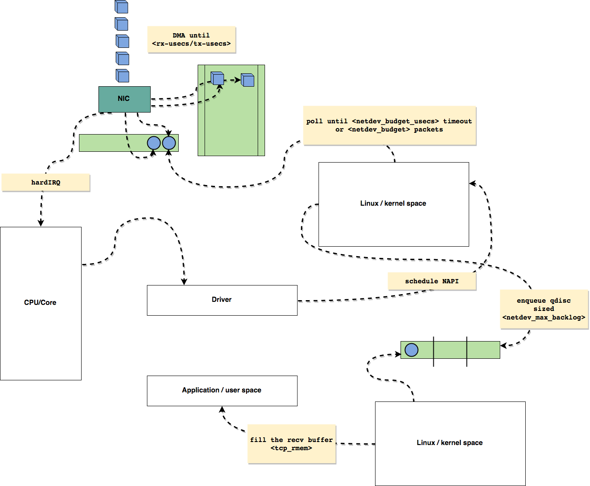
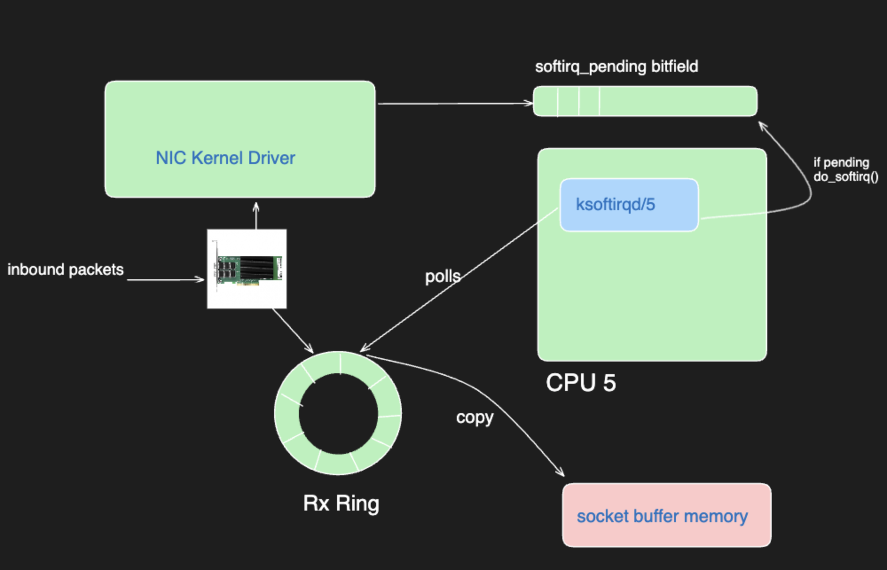

# Packet Loss Optimization

This directory summarizes a practical approach to diagnosing and reducing packet loss on Azure Kubernetes Service (AKS) nodes, especially when running high-throughput workloads on accelerated networking with SR-IOV.

## Why packet loss happens in AKS

AKS nodes with accelerated networking can receive traffic directly through SR-IOV virtual functions. That reduces hypervisor overhead, but it also means the guest OS and applications must keep up with three main buffering layers:

1. NIC receive queues and ring buffers.
2. Per-CPU backlog queues in the Linux network stack.
3. Socket and application-layer memory, such as TCP receive/send memory accounting via `tcp_mem`.

Under bursty traffic, packet drops can show up in multiple places:

- `missed` on the SR-IOV interface when the NIC cannot place packets into RX ring buffers fast enough.
- `dropped` on host or pod-facing interfaces when the kernel backlog or container path cannot drain packets quickly enough.
- Elevated `ksoftirqd/*` CPU usage when IRQ or softirq work collapses onto too few CPUs.

## Packet path overview

The Linux receive path is the key mental model for this issue because packet loss can happen at several handoff points as traffic moves from the physical interface into the kernel network stack.

At a high level, the handoff looks like this:

1. A packet arrives on the NIC at Layer 1 and is placed into a hardware receive queue.
2. The NIC DMA engine writes that frame into an RX ring buffer in host memory.
3. The NIC raises a hardware interrupt so the CPU can run the NIC driver.
4. The driver schedules NAPI and packet handling moves into `NET_RX_SOFTIRQ` processing.
5. Linux wraps the received frame in an `sk_buff` and begins Layer 2 handling for the Ethernet frame.
6. The kernel strips the Ethernet header, validates metadata, and passes the packet into Layer 3 handlers such as `ip_rcv` for IPv4.
7. The packet may wait in per-CPU backlog queues if the stack is briefly slower than the incoming rate.
8. From there it continues to Layer 4 processing such as TCP or UDP and finally to the socket buffer used by the application.

These handoffs depend on several OS and NIC components working together:

- NIC hardware queues and RX ring descriptors absorb bursts from the wire.
- IRQ handling and NAPI polling move work from hard interrupts into batched kernel processing.
- `sk_buff` allocation and the Linux receive path move frames from Ethernet handling to IP routing and transport processing.
- Per-CPU backlog queues and socket buffers absorb short imbalances between arrival rate and consumption rate.



If any of these buffering stages cannot absorb microbursts, throughput becomes unstable and retransmissions increase.

## Common failure patterns

### 1. RX ring overflow on SR-IOV NICs

Elastic observed large `missed` counts on the accelerated networking interface. That usually means bursts are overrunning the receive ring before the guest kernel can drain it.

Check:

```bash
ip -s link show
ethtool -g <iface>
ethtool -S <iface>
```

Typical mitigation:

```bash
ethtool -G <iface> rx 8192 tx 8192
```

On AKS nodes, this is often rolled out with a privileged DaemonSet plus a `udev` rule so the value is restored across reboots or interface recreation.

### 2. Kernel backlog saturation

After RX ring tuning, remaining drops may still occur deeper in the stack, especially around `enqueue_to_backlog` when the kernel cannot keep up with ingress processing.

Check:

```bash
sysctl net.core.netdev_max_backlog
cat /proc/net/softnet_stat
```

Typical mitigation:

```bash
sysctl -w net.core.netdev_max_backlog=32768
```

This increases the ingress backlog queue so short bursts are less likely to be dropped before higher network layers process them.

### 3. IRQ imbalance after VM events

Zain Malik documented a separate but related AKS issue where interrupts became pinned to a small subset of CPUs after a VM freeze event. In that state, `ksoftirqd` on one core can hit 100% while packets drop for containers on the node.



Check:

```bash
cat /proc/interrupts
for i in /proc/irq/*/smp_affinity; do echo "$i $(cat "$i")"; done
systemctl status irqbalance
perf record -a -g -- sleep 60
```

Useful signals:

- One or two CPUs handling most NIC interrupts.
- `ksoftirqd/<cpu>` dominating CPU time.
- Container packet-drop counters rising on affected nodes.

Immediate mitigation:

```bash
systemctl try-restart irqbalance
```

In managed AKS environments, this can be automated with a privileged DaemonSet that detects bad IRQ affinity and restarts `irqbalance` from the host namespace.

## Practical troubleshooting flow

1. Confirm packet loss symptoms with workload metrics and host counters.
2. Run `ip -s link show` and identify whether loss appears as `missed`, `dropped`, or both.
3. Inspect NIC ring sizes with `ethtool -g`.
4. Inspect softirq pressure with `cat /proc/net/softnet_stat` and CPU skew with `cat /proc/interrupts`.
5. Use `perf` if needed to confirm whether drops are associated with `enqueue_to_backlog`, `veth`, or heavy softirq processing.
6. Tune one layer at a time and re-run the workload.

## Suggested AKS tuning checklist

- Increase RX ring sizes on accelerated Mellanox interfaces when `missed` grows under load.
- Increase `net.core.netdev_max_backlog` when drops move into the kernel ingress path.
- Verify IRQ distribution across CPUs and make sure `irqbalance` is healthy.
- Monitor pod-facing `veth` interfaces, not just `eth0`.
- Validate changes with repeatable load tests such as `iperf3` or application-specific benchmarks.

## Example commands

```bash
# Interface counters
ip -s link show

# Ring parameters
ethtool -g eth0
ethtool -g enP42266s1

# Ring statistics
ethtool -S enP42266s1

# Softnet pressure
cat /proc/net/softnet_stat

# IRQ distribution
cat /proc/interrupts

# Backlog size
sysctl net.core.netdev_max_backlog

# Temporary backlog tuning
sysctl -w net.core.netdev_max_backlog=32768

# Temporary ring tuning
ethtool -G enP42266s1 rx 8192 tx 8192

# Restart irqbalance if IRQs are skewed
systemctl try-restart irqbalance
```

## References

- https://www.elastic.co/observability-labs/blog/debugging-aks-packet-loss
- https://blog.zmalik.dev/p/packet-drop
- https://github.com/leandromoreira/linux-network-performance-parameters/tree/master?tab=readme-ov-file#linux-network-queues-overview
