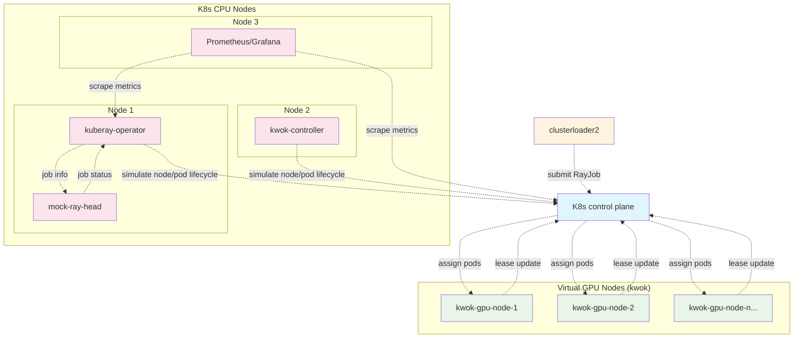

# Ray Workloads Scheduling System Design

## Component Description

### K8s Control Plane
- **K8s control plane**: Unified Kubernetes control plane containing kube-apiserver, kube-scheduler, kube-controller-manager, and etcd for managing cluster operations, pod scheduling, and state storage

### Load Generator
- **clusterloader2**: Submits RayJob resources to test cluster performance and scalability

### K8s CPU Nodes
- **kuberay-operator**: Reconciles RayJob resources into RayCluster and manages Ray workload lifecycle
- **kwok-controller**: Simulates and manages virtual GPU nodes without actual hardware
- **mock-ray-head**: Provides mock Ray head node functionality and job status APIs
- **Prometheus/Grafana**: Provides monitoring, metrics collection, and visualization dashboards

### Virtual GPU Nodes (kwok)
- Simulated GPU nodes that appear as real nodes to the Kubernetes scheduler
- Managed by kwok-controller to provide realistic GPU node behavior
- Allow testing Ray workload scheduling without actual GPU hardware

## Workflow

1. **Load Generation**: clusterloader2 submits RayJob resources to test cluster performance
2. **Job Submission**: RayJob is submitted to the K8s control plane
3. **Reconciliation**: kuberay-operator watches for RayJob changes and creates corresponding RayCluster
4. **Pod Creation**: RayCluster generates Ray worker and head pods
5. **Scheduling**: K8s control plane assigns pods to available kwok GPU nodes
6. **Node Simulation**: kwok-controller simulates the behavior of GPU nodes
7. **Status Monitoring**: kuberay-operator makes HTTP calls to mock-ray-head for job status
8. **Completion**: Based on status from mock-ray-head, kuberay-operator marks RayJob as complete
9. **Monitoring**: Prometheus/Grafana collects metrics and provides visualization dashboards